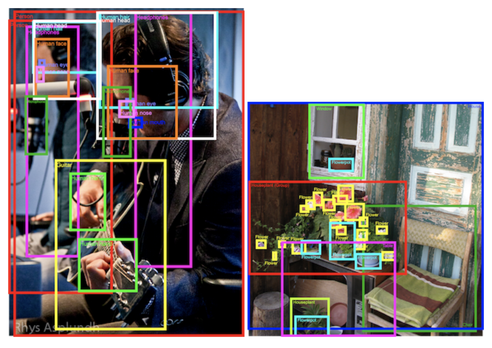

# kaggle_Open_Images_Object_Detection_RVC_2020
The train and validation sets of images and their ground truth (bounding boxes and labels) should be downloaded from Open Images Challenge page. Please note that the test images used in this competition is independent from those released as part of the Open Images Dataset.

# Object Detection Track
In this track, you are asked to predict a tight bounding box around object instances.

The training set contains 12.2M bounding-boxes across 500 categories on 1.7M images. The boxes have been largely manually drawn by professional annotators to ensure accuracy and consistency. The images are very diverse and often contain complex scenes with several objects (7 per image on average).

Example annotations. Left: Mark Paul Gosselaar plays the guitar by Rhys A. Right: the house by anita kluska. Both images used under CC BY 2.0 license.

The training data, format, and submission modalities are identical to the 2019 Open Images Challenge.

# Open Images Object Detection RVC 2020 edition
# Detect objects in varied and complex images

  Using FasterRCNN+InceptionResNet V2, an SSD-based object detection model trained on Open Images V4 with ImageNet pre-trained   MobileNet V2 as image feature extractor.

# Acknowledgements

a) tensorflow hub
b) kernels pull singhuday/image-object-detection

